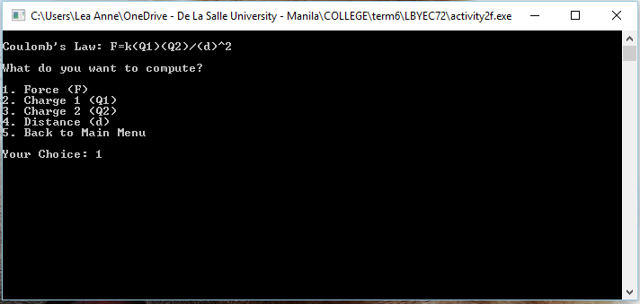
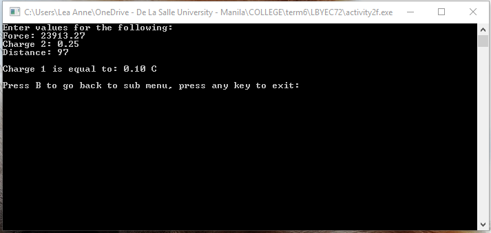

# lbyec72-ei2-prelimactivitynumber2-donotincludeanycode-learulloda
###Lea Anne R. Rulloda - EI2
```
This is the main menu.
```

```
My first equation is Coulomb's Law. The user is asked what variable to compute.
```

```
The user is asked to input the values of the other three variables.
The user is also asked if he wants to return to the sub menu or to exit the program.
```


```
This is now the second variable of the first equation. As you can see, I used the same values of the other
variables from the first choice to prove that the computations in each variable is correct. These inputs are
consistently used in the test run of all four variables. 
```



```
This is the test run of an invalid input.
```

```
If the input is invalid, the computer will indicate that it is
also, the user is asked to return to the sub menu or to exit the program.
```


```
The user is now back to the main menu and chooses the second equation.
```


```
I pretty much did the same test run for the second equation as the first one.
The values used were also consistent.
```


```
An invalid input also lets the user to choose to go back to the sub menu or to exit the program.
```


```
The user is again back to the main menu.
```

```
An invalid input in the main menu makes the computer display "Invalid Input!"
and then go back to the main menu.
```


